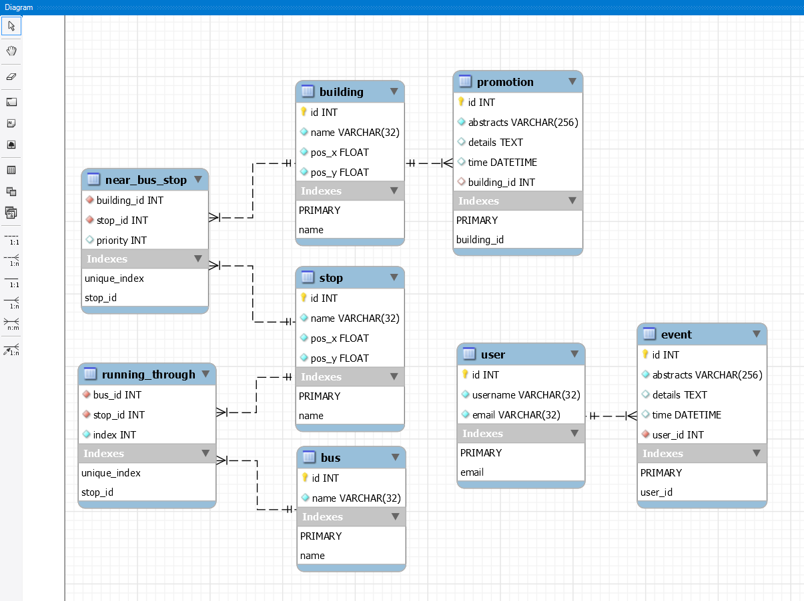
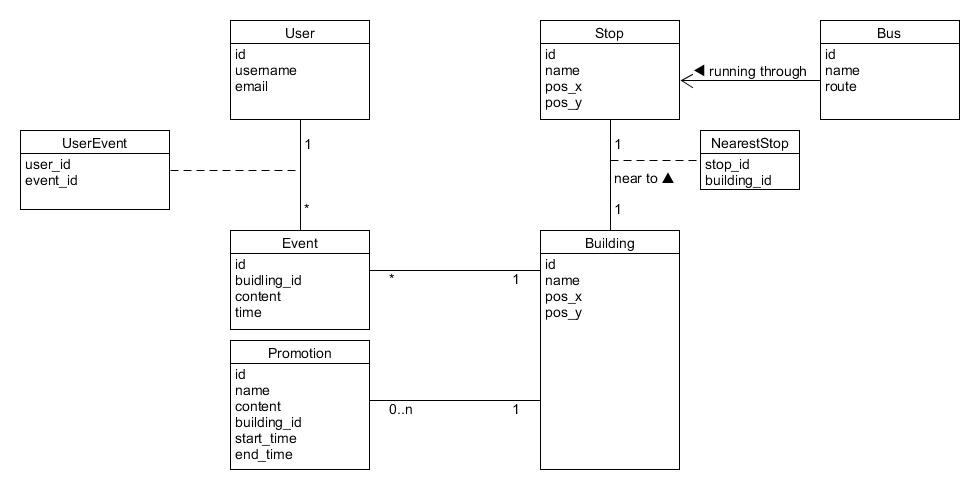

# Database Design (Version 1.0)

## ER

This ER is generated by MySQL Workbench, which is exactly what we used in the Database.




## SQL Code

```mys
USE nustour_db;

-----------------------------------------
--              CREATE TABLES
-----------------------------------------

CREATE TABLE IF NOT EXISTS `user` (
--   name         type            constraints
    `id`          INT             NOT NULL    AUTO_INCREMENT,
    `username`    VARCHAR(32)     NOT NULL,
    `email`       VARCHAR(32)     NOT NULL    UNIQUE,

    PRIMARY KEY (`id`)
);


CREATE TABLE IF NOT EXISTS `bus` (
--  name          type            constraints
    `id`          INT             NOT NULL        AUTO_INCREMENT,
    `name`        VARCHAR(32)     NOT NULL        UNIQUE,

    PRIMARY KEY (`id`)
);


CREATE TABLE IF NOT EXISTS `stop` (
--  name          type            constraints
    `id`          INT             NOT NULL          AUTO_INCREMENT,
    `name`        VARCHAR(32)     NOT NULL          UNIQUE,
    `pos_x`       FLOAT           NOT NULL,
    `pos_y`       FLOAT           NOT NULL,

    PRIMARY KEY (`id`)
);


CREATE TABLE IF NOT EXISTS `building` (
--  name          type            constraints
    `id`          INT             NOT NULL      AUTO_INCREMENT,
    `name`        VARCHAR(32)     NOT NULL      UNIQUE,
    `pos_x`       FLOAT           NOT NULL,
    `pos_y`       FLOAT           NOT NULL,

    PRIMARY KEY (`id`)
);


CREATE TABLE IF NOT EXISTS `event` (
--  name          type            constraints
    `id`          INT             NOT NULL    AUTO_INCREMENT,
    `abstracts`   VARCHAR(256)    NOT NULL,
    `details`     TEXT,
    `time`        DATETIME,

    `user_id`     INT             NOT NULL,

    PRIMARY KEY (`id`),
    FOREIGN KEY (`user_id`) REFERENCES user(`id`)
);


CREATE TABLE IF NOT EXISTS `promotion` (
--  name          type            constraints
    `id`          INT             NOT NULL    AUTO_INCREMENT,
    `abstracts`   VARCHAR(256)    NOT NULL,
    `details`     TEXT,
    `time`        DATETIME,

    `building_id` INT,

    PRIMARY KEY (`id`),
    FOREIGN KEY (`building_id`) REFERENCES building(`id`)
);


CREATE TABLE IF NOT EXISTS `running_through` (
--  name          type            constraints
    `bus_id`      INT             NOT NULL,
    `stop_id`     INT             NOT NULL,
    `index`       INT             NOT NULL,

    FOREIGN KEY (`bus_id`) REFERENCES bus(`id`),
    FOREIGN KEY (`stop_id`) REFERENCES stop(`id`),

    CONSTRAINT unique_index UNIQUE (`bus_id`, `stop_id`, `index`)
);


CREATE TABLE IF NOT EXISTS `near_bus_stop` (
--  name          type            constraints
    `building_id` INT             NOT NULL,
    `stop_id`     INT             NOT NULL,
    `priority`    INT             DEFAULT(2),

    FOREIGN KEY (`building_id`) REFERENCES building(`id`),
    FOREIGN KEY (`stop_id`) REFERENCES stop(`id`),

    CONSTRAINT unique_index UNIQUE (`building_id`, `stop_id`)
);


-- -------------------------------------------------
-- End of initialization
-- -------------------------------------------------
```


## Appendix

### 1. Domain Model (Version 0.1) 

>  Derive from last version, changed a lot.



